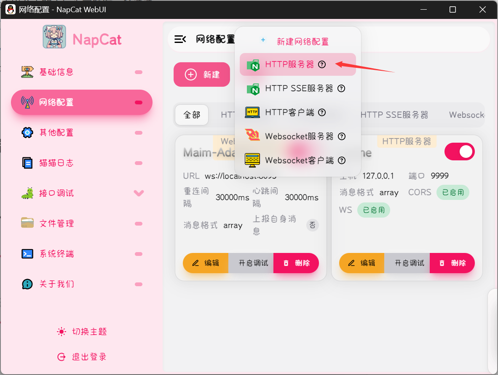
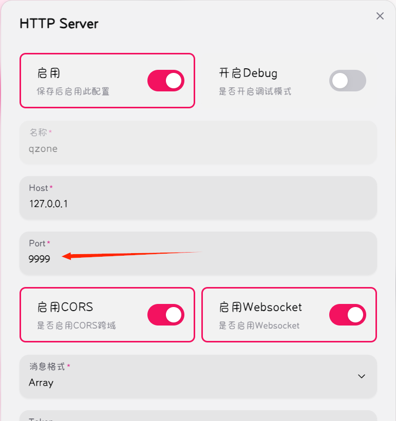
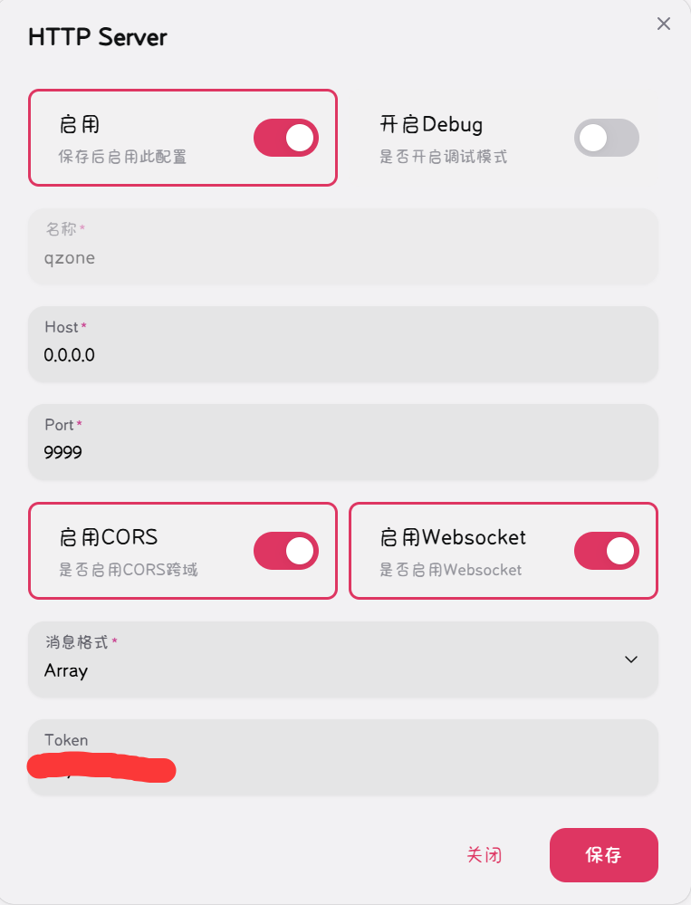
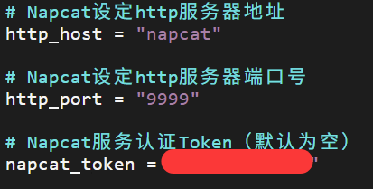
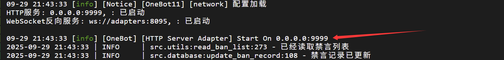

# Maizone（麦麦空间） 插件

> [!IMPORTANT]
>
> 为了您的安全，请设置Token。操作方法：在设置http服务器时面板最下方的Token栏中填入密码，在生成的config.toml文件中填写该密码

*制作者水平稀烂，任何疑问或bug或建议请联系qq：1523640161*

## 概述

Maizone（麦麦空间）插件v2.4.11，让你的麦麦发说说，读QQ空间，点赞评论！

## 功能

- **发说说**: 当用户说"说说"、"qq空间"、"动态"时麦麦会决定是否发说说和说说的主题
- **说说配图**：可以从已注册表情包中选择，或用ai生成配图，或随机选择
- **读说说**：当用户要求麦麦读说说、qq空间，并指定目标的qq昵称时，麦麦会获取该目标账号最近的动态并点赞评论
- **权限管理**：在config.toml中指定谁可以让麦麦读说说或发说说
- **自动阅读**：开启此功能让麦麦秒赞秒评新说说，回复评论
- **定时发送**：开启此功能让麦麦定时发说说

## 使用方法

### 安装插件

1. 下载或克隆本仓库（麦麦旧版本可在release中下载适配旧版的插件）

   ```bash
   git clone https://github.com/internetsb/Maizone.git
   ```
2. 将 `Maizone\`文件夹放入 `MaiBot\plugins`文件夹下（路径中不要含有标点符号，中文字符）
3. 根据部署方式安装相应依赖，示例：

   - 一键包安装：在启动时选择交互式安装pip模块，安装bs4和json5
   - docker部署安装：宿主机内

     ```bash
     docker exec -it maim-bot-core uv pip install bs4 json5 --system
     ```
   - uv安装：在plugins\Maizone文件夹下

     ```bash
     uv pip install -r .\requirements.txt -i https://mirrors.aliyun.com/pypi/simple --upgrade
     ```
   - pip安装：在MaiBot文件夹下

     ```bash
     #pip安装，在MaiBot文件夹下
     .\venv\Scripts\activate
     cd .\plugins\Maizone\
     pip install -i https://mirrors.aliyun.com/pypi/simple -r .\requirements.txt --upgrade
     ```

     启动一次麦麦自动生成 `config.toml`配置文件，成功生成配置文件即说明读取插件成功（未生成配置文件请检查启动麦麦时的加载插件日志）

### 设置Napcat http服务器端口以获取cookie





启用后在配置文件config.toml（若无则先启动一次）中填写上在napcat中设置的host（默认127.0.0.1）和端口号（默认9999）用于获取cookie

**B方案：Napcat连接失败后启用，请确保QQ客户端在同一机器上启动，并登录qq空间**

**C方案：B方案失败后启用，请用botQQ扫描插件目录下的二维码登录（有效期约一天）**

**D方案：读取已保存的cookie，可手动填写，[如何获取QQ空间cookie？](https://www.xjr7670.com/articles/how-to-get-qzone-cookie.html)**

> [!IMPORTANT]
>
> **Docker部署使用方法**
>
> 将Napcat设置的HTTP Server的Host栏改为0.0.0.0，插件的config.toml中的http_host栏改为"napcat"（注意引号）。经测试可正常使用
>
> **NapCat设置**
>
> 
>
> **插件config设置**
>
> 
>
> **正常监听后的日志显示**
>
> 

### 修改配置文件

请检查：

1. MaiBot/config/bot_config.toml中qq_account是否为bot的QQ号

  请设置：

2. 是否启用插件及各种功能
3. 是否启用说说配图和ai生成配图（及相应的api_key）
4. 权限名单及类型

更多配置请看config.toml中的注释

### （可选）AI生图

1. 注册登录ModelScope或SiliconFlow或火山引擎，获取访问令牌/APIkey
2. 从模型库中选择文生图（若开启参考图则选择图生图）标签的模型，复制名称
3. 填写至config.toml的models栏
4. （可选）若有bot的人设图或者头像之类的，保存图片并命名为"done_ref.xxx"（xxx可为jpg,png等等）放入插件的images目录下，修改config.toml的image_ref为true，即可尝试让ai参考该图来生成图片（需要图生图模型）（请注意，ModelScope图生图暂不可用）

   若要使用其余模型及供应商，自行修改utils.py中的generate_image函数，将生成的图片保存至image_dir即可

### 快速开始

**配置权限**：在config.toml中分别填写上send和read模块中的权限名单和类型

**发说说**：向麦麦发送命令：`/send_feed` 或说 “发条说说吧”/“发一条你今天心情的说说” 正常情况下，等待几秒后麦麦将发送一条相应主题的说说至QQ空间

**读说说**：对麦麦说：“读一下我的QQ空间”/“评价一下@xxx的空间”，麦麦将会对其近几条评论进行点赞评论

**自动看说说**：在config.toml中monitor开启，麦麦会自动阅读新说说并点赞、评论（并回复自己说说下的评论）

**定时发说说**：在config.toml中schedule开启，麦麦会定时发送说说

**（可选）给项目star**：（不给也可以）

## 常见问题

- **Q：所有功能都失败爆红**

  **A：请检查是否生成cookie，cookie名称与内容中的qq号是否正确，MaiBot/config/bot_config.toml中qq_account是否填写正确**
- **Q：No module named 'bs4'**

  **A：安装依赖失败，请确保在MaiBot运行的环境下，按照安装麦麦时的方法，选择恰当的给出的方式安装依赖**
- **Q：No module named 'plugins.Maizone-2'**/**'No module named 'plugins.internetsb'**

  **A：'.'导致被错误地识别为了包，请重命名文件夹为Maizone，不要含有标点符号及中文字符**
- **Q：提示词为空，无法正常回复/回复“你好，我能为你做什么？”...**

  **A：版本更新导致的bug（我很抱歉），请删除config.toml重新生成**
- **Q：我发了一条说说，但bot没有回复**

  **A：bot无法阅读相册上传、小程序分享、过早的说说，且某些说说（比如新加的好友）需要多次才能读到，具体读取情况以日志为准**
- **Q:listen EACCES: permission denied 127.0.0.1:9999**

  **A：可能为端口9999被占用，可选择更换为其它端口，并修改相应配置**
- **Q：如何更改使用的模型配置**

  **A：请查看MaiBot/config/model_config.toml，默认使用**

  ```
  [model_task_config.replyer] # 首要回复模型，还用于表达器和表达方式学习
  model_list = ["xxxxxx"]
  temperature = xxx
  max_tokens = xxx
  ```

  **可更换为配置的utils、utils_small、tool_use等模型，模型列表配置参看MaiBot文档**
- **其余问题请联系作者修复或解决（部分好友请求可能被过滤导致回复不及时，请见谅）**

## 鸣谢

[MaiBot](https://github.com/MaiM-with-u/MaiBot)

部分代码来自仓库：[qzone-toolkit](https://github.com/gfhdhytghd/qzone-toolkit)

感谢[xc94188](https://github.com/xc94188)、[myxxr](https://github.com/myxxr)、[UnCLAS-Prommer](https://github.com/UnCLAS-Prommer)、[XXXxx7258](https://github.com/XXXxx7258)、[heitiehu-beep](https://github.com/heitiehu-beep)提供的功能改进

魔改版麦麦，集成了魔改版插件[MoFox_Bot](https://github.com/MoFox-Studio/MoFox_Bot)
